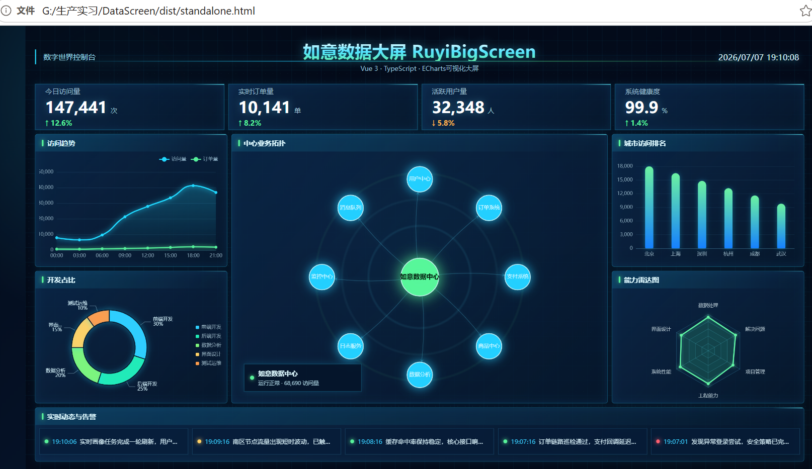

# 如意数据大屏

这是一个基于 Vue 3、Vite 和 ECharts 的数据大屏项目。

## 环境要求

请先安装 Node.js LTS 版本。

可以在命令行中检查：

```bash
node -v
npm -v
```

## 安装依赖

第一次运行项目时，在项目目录执行：

```bash
npm install
```

如果使用项目里的 `.bat` 启动脚本，脚本会在没有 `node_modules` 时自动安装依赖。

## 启动开发预览

### 方式一：双击启动

双击：

```text
启动项目.bat
```

脚本会自动打开浏览器并访问：

```text
http://localhost:5173/
```

命令窗口需要保持打开，关闭窗口后开发服务器会停止。

### 方式二：命令行启动

在项目目录执行：

```bash
npm run dev
```

然后在浏览器打开：

```text
http://localhost:5173/
```

## 生成打包文件

执行：

```bash
npm run build
```

构建完成后会生成 `dist` 目录，主要文件包括：

```text
dist/index.html
dist/standalone.html
dist/assets/
```

其中 `dist/standalone.html` 是单文件版本，可以直接双击打开。

## 一键生成并打开单文件版

双击：

```text
生成双击版并打开.bat
```

脚本会自动执行打包，并打开：

```text
dist/standalone.html
```

## 常用命令

```bash
npm run dev      # 启动开发服务器
npm run build    # 生成 dist 打包文件
npm run preview  # 预览生产构建结果
```

## 文件说明

- `index.html`：Vite 项目入口文件，不能删除。
- `src/`：项目源码目录。
- `dist/`：打包输出目录，可以删除，重新执行 `npm run build` 会再次生成。
- `node_modules/`：依赖目录，可以删除，但删除后需要重新执行 `npm install`。
- `启动项目.bat`：Windows 双击启动开发预览。
- `生成双击版并打开.bat`：Windows 双击打包并打开单文件页面。
